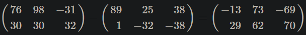
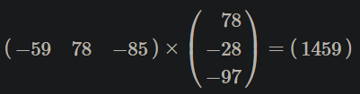
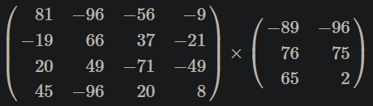
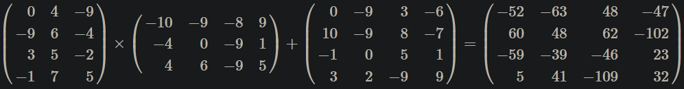
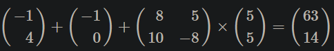
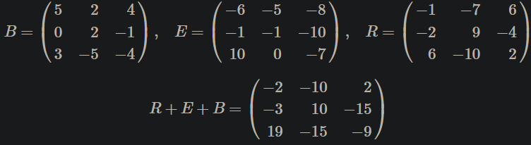
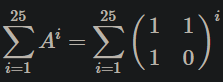

# Úkol 5 - Maticové počty

| Termín odevzdání | 15.04.2023 23:59 AoE                                                                           |
|------------------|------------------------------------------------------------------------------------------------|
| Povinné zadání   | 2b kontrola Coding Stylu                                                                       |
| Volitelné zadání | 3b                                                                                             |
| Bonusové zadání  | 4b 26.05.2023 23:59 CEST                                                                       |
| Počet uploadů    | 20                                                                                             |
| Výchozí soubory  | [b3b36prg-hw05.zip](files/b3b36prg-hw05.zip)<br>[b3b36prg-hw05b.zip](files/b3b36prg-hw05b.zip) |


V této úloze budete mít za úkol implementovat maticové operace sčítání, odčítání a násobení. Všechny prvky všech matic (i v průběhu výpočtu) se vejdou do 32-bitového znaménkového typu integer.

Pokud nebude vstup ve správném formátu nebo nepůjde provést příslušnou maticovou operaci, tak vypiště “Error: Chybny vstup!” a konec řádku na standardní chybový výstup a ukončete program s návratovou hodnotou 100. Není třeba kontrolovat bílé znaky (mezery a nové řádky); stačí tedy ověřit, že jsou na vstupu dvě celá čísla reprezentující velikost matice a následně správný počet celých čísel odpovídající velikosti matice (například pomocí scanf()).


> [!WARNING]
> Pokud budete používat dynamickou alokaci paměti (malloc(), calloc()), tak doporučujeme použít program [Valgrind](https://valgrind.org/) ještě před nahráním do odevzdávacího systému pro kontrolu práce s pamětí.

> [!TIP]
> Velikost vstupních matic (povinného a volitelného zadání) je přesně specifikována vstupním formátem, proto je doporučeno načítat vstup postupně po celých číslech a nikoliv po řádcích např. funkcí getline(). V případě bonusového zadání se může použití funkce getline() zdát výhodné, ale ani tady to není nutné. Opět můžete načítat první řádek postupně po celých číslech a tím identifikovat počet sloupců. Následně můžete již alokovat potřebnou velikost paměti, např. funkcí realloc() a postupovat identicky s povinným/volitelným zadáním.

## Povinné zadání
Na standardním vstupu jsou pouze dvě matice s jednou operací (+,-,*). Vaším úkolem je provést zadanou operaci a vypsat na standardní výstup výslednou matici.

## Formát vstupu
Na standardním vstupu jsou dvě nebo i více matic oddělených jedním řádkem se znakem operace (+,-,*). Každá matice má na prvním řádku nejprve svoji velikost (n, m) a následuje n řádků vždy s m hodnotami matice. Jednotlivé hodnoty jsou oddělené mezerami (whitespaces).

## Formát výstupu
Formát výstupu je stejný, ale obsahuje pouze jednu matici. Nezapomeňte, že na konci řádku není mezera a i za posledním řádkem je znak nového řádku.

Příklad 1 - pub01-m


| Standardní vstup                                                               | Očekávaný výstup                           | Očekávaný chybový výstup | Návratová hodnota |
|--------------------------------------------------------------------------------|--------------------------------------------|--------------------------|-------------------|
| <pre>2 3<br>76 98 -31<br>30 30 32<br>-<br>2 3<br>89 25 38<br>1 -32 -38</pre>   | <pre>2 3<br>-13 73 -69<br>29 62 70</pre>   | žádný                    | 0                 |

Příklad 2 - pub02-m


| Standardní vstup                                             | Očekávaný výstup       | Očekávaný chybový výstup | Návratová hodnota |
|--------------------------------------------------------------|------------------------|--------------------------|-------------------|
| <pre>1 3<br>-59 78 -85<br>*<br>3 1<br>78<br>-28<br>-97</pre> | <pre>1 1<br>1459</pre> | žádný                    | 0                 |

Příklad 3 - pub03-m

| Standardní vstup                                           | Očekávaný výstup | Očekávaný chybový výstup         | Návratová hodnota |
|------------------------------------------------------------|------------------|----------------------------------|-------------------|
| <pre>2 3<br>16 41 -98<br>*<br>3 1<br>96<br>-67<br>49</pre> | žádný            | <pre>Error: Chybny vstup!</pre>  | 100               |

Příklad 4 - pub04-m


| Standardní vstup                                                                                                         | Očekávaný výstup | Očekávaný chybový výstup         | Návratová hodnota |
|--------------------------------------------------------------------------------------------------------------------------|------------------|----------------------------------|-------------------|
| <pre>4 4<br>81 -96 -56 -9<br>-19 66 37 -21<br>20 49 -71 -49<br>45 -96 20 8<br>*<br>3 2<br>-89 -96<br>76 75<br>65 2</pre> | žádný            | <pre>Error: Chybny vstup!</pre>  | 100               |

## Volitelné zadání

Na vstupu je sekvence matic o maximální délce 100 spolu se zadanými operacemi. Operace vyhodnocujte podle jejich priority a vypište až výslednou matici. To odpovídá tomu, jako kdyby byl následující výraz s maticemi A až F:

<pre>A+B∗C+D∗E−F</pre>pre>

ozávorkován následujícím způsobem:

<pre>A+(B∗C)+(D∗E)−F</pre>

## Příklad 1 - pub01-o

(64)+(−67)+(−6−4)=(−67)

| Standardní vstup                                               | Očekávaný výstup       | Očekávaný chybový výstup | Návratová hodnota |
|----------------------------------------------------------------|------------------------|--------------------------|-------------------|
| <pre>1 2<br>6 4<br>+<br>1 2<br>-6 7<br>+<br>1 2<br>-6 -4</pre> | <pre>1 2<br>-6 7</pre> | žádný                    | 0                 |

Příklad 2 - pub02-o


| Standardní vstup                                                                                                                                                           | Očekávaný výstup                                                                    | Očekávaný chybový výstup | Návratová hodnota |
|----------------------------------------------------------------------------------------------------------------------------------------------------------------------------|-------------------------------------------------------------------------------------|--------------------------|-------------------|
| <pre>4 3<br>0 4 -9<br>-9 6 -4<br>3 5 -2<br>-1 7 5<br>*<br>3 4<br>-10 -9 -8 9<br>-4 0 -9 1<br>4 6 -9 5<br>+<br>4 4<br>0 -9 3 -6<br>10 -9 8 -7<br>-1 0 5 1<br>3 2 -9 9</pre> | <pre>4 4<br>-52 -63 48 -47<br>60 48 62 -102<br>-59 -39 -46 23<br>5 41 -109 32</pre> | žádný                    | 0                 |

Příklad 3 - pub03-o

| Standardní vstup                                                                       | Očekávaný výstup | Očekávaný chybový výstup   | Návratová hodnota |
|----------------------------------------------------------------------------------------|------------------|----------------------------|-------------------|
| <pre>2 2<br>3 x10<br>-9 5<br>+<br>2 2<br>8 -5<br>1 8<br>+<br>2 2<br>-4 6<br>-2 8</pre> | žádný            | ```Error: Chybny vstup!``` | 100               |

Příklad 4 - pub04-o


| Standardní vstup                                                                                   | Očekávaný výstup           | Očekávaný chybový výstup | Návratová hodnota |
|----------------------------------------------------------------------------------------------------|----------------------------|--------------------------|-------------------|
| <pre>2 1<br>-1<br>4<br>+<br>2 1<br>-1<br>0<br>+<br>2 2<br>8 5<br>10 -8<br>*<br>2 1<br>5<br>5</pre> | <pre>2 1<br>63<br>14</pre> | žádný                    | 0                 |


## Bonusové zadání
Na vstupu jsou matice zadány ve formátu název=[x11 x12...x1n;x21 x22...x2n;...;xm1 xm2...xmm] a maticová operace je poté zadána pomocí názvů jednotlivých matic.
- názvy matic jsou velká písmena, přičemž seznam matic předchází zadané operaci
- definice jedné matice zabírá jeden řádek
- členy matice se zapisují do hranatých závorek
- jednotlivé členy na řádku jsou odděleny mezerou, jednotlivé řádky jsou odděleny středníkem
- výpočet je oddělen od definic matic volným řádkem
- výpočetní operace se skládá z libovolného množství operandů.
- operandy jsou pouze +,-,* přičemž operace se vyhodnocují podle priority stejně jako u volitelného zadání
- výstupem programu je výsledek maticové operace formátovaný podle pravidel popsaných výše
- počet matic je omezen počtem písmen v abecedě, ale délka výrazu není nijak omezena

## Příklad 1 - pub01-b


| Standardní vstup                                                                                                        | Očekávaný výstup                            | Očekávaný chybový výstup | Návratová hodnota |
|-------------------------------------------------------------------------------------------------------------------------|---------------------------------------------|--------------------------|-------------------|
| <pre>B=[5 2 4; 0 2 -1; 3 -5 -4]<br>E=[-6 -5 -8; -1 -1 -10; 10 0 -7]<br>R=[-1 -7 6; -2 9 -4; 6 -10 2]<br><br>R+E+B</pre> | <pre>[-2 -10 2; -3 10 -15; 19 -15 -9]</pre> | žádný                    | 0                 |

## Příklad 2 - pub02-b

| Standardní vstup                                                                   | Očekávaný výstup        | Očekávaný chybový výstup | Návratová hodnota |
|------------------------------------------------------------------------------------|-------------------------|--------------------------|-------------------|
| <pre>K=[-10 0 2; -6 10 -6; -9 2 0]<br>D=[0 6 7]<br>M=[10 -5 -4]<br><br>D*K+M</pre> | <pre>[-89 69 -40]</pre> | žádný                    | 0                 |

## Příklad 3 - pub03-b

| Standardní vstup                                                      | Očekávaný výstup                       | Očekávaný chybový výstup | Návratová hodnota |
|-----------------------------------------------------------------------|----------------------------------------|--------------------------|-------------------|
| <pre>R=[6 9; -3 9; -9 10]<br>K=[2 -8 8; -1 2 -4]<br><br>K+K*R*K</pre> | <pre>[-96 332 -384; 78 -252 312]</pre> | žádný                    | 0                 |

## Příklad 4 - pub04-b

| Standardní vstup                                      | Očekávaný výstup                             | Očekávaný chybový výstup | Návratová hodnota |
|-------------------------------------------------------|----------------------------------------------|--------------------------|-------------------|
| <pre>M=[-9 5 9; -7 8 7; 10 -3 3]<br><br>M*M+M-M</pre> | <pre>[136 -32 -19; 77 8 14; -39 17 78]</pre> | žádný                    | 0                 |

…

## Příklad 10 - pub10-b

Poslední veřejný příklad je inspirován jedním ze způsobů výpočtu [Fibonacciho čísla](https://cs.wikipedia.org/wiki/Fibonacciho_posloupnost). Výsledná matice bude obsahovat sumy prvních 24, 25 [^1] a 26 Fibonacciho čísel.


| Standardní vstup                                                              | Očekávaný výstup                          | Očekávaný chybový výstup | Návratová hodnota |
|-------------------------------------------------------------------------------|-------------------------------------------|--------------------------|-------------------|
| <pre>A=[1 1; 1 0]<br><br>A+A*A+A*A*A+A*A*A*A+A*A*A*A*A+A*A*A*A*A*A+ ...</pre> | <pre>[317809 196417; 196417 121392]</pre> | žádný                    | 0                 |

## Odevzdání a hodnocení

Výchozí zip soubory obsahují binární spustitelné soubory referenčního řešení hw05-test a hw05b-test, které lze použít pro ověření funkčnosti programu před jeho odevzdáním. Kromě přiložených testovacích vstupních souborů je doporučeno vytvořit si další testovací vstupy.

## Kompilace a sestavení programu v US

Váš program může být složený z více souborů. [^2] Odevzdané soubory překládany a linkovány předpisem Makefile pro GNU Make uvedeným níže. Skript je napsán tak, aby využíval automatické detekce zdrojouvých souborů .c, ale zároveň umožňoval specifikovat konkrétní pořadí linkovaných objektových souborů (.o). V případě, kdy je nutné explicitně uvést pořadí tak, aby při sestavení byly postupně zjišťovány jednotlivé funkce definované v ostatních modulech, je možné využít předpisu pořadí zdrojových souborů v souboru modules.mk, který je načítán před automatickou detekcí zdrojových souborů.

```
uniq = $(if $1,$(firstword $1) $(call uniq,$(filter-out $(firstword $1),$1)))
 
-include modules.mk
 
HW=hw05
TARGET=main
 
CFLAGS+=-std=c99 -g -pedantic -Wall -Werror
LDFLAGS+=-lm
 
SRC:=$(TARGET).c $(SRC)
SRC+=$(wildcard *.c)
 
OBJS:=$(patsubst %.c,%.o,$(call uniq,$(SRC)))
 
bin: $(TARGET)
 
$(OBJS): %.o: %.c
	$(CC) -c $< $(CFLAGS) $(CPPFLAGS) -o $@
 
$(TARGET): $(OBJS)
	$(CC) $(OBJS) $(LDFLAGS) -o $@ 
 
clean:
	$(RM) $(OBJS) $(TARGET)
	$(RM) -f ${HW}-brute.zip
 
.PHONY: clean zip
```

|                        | Povinné zadání                             | Volitelné zadání                       | Bonusové zadání                             |
|------------------------|--------------------------------------------|----------------------------------------|---------------------------------------------|
| Název v BRUTE          | HW05                                       | HW05                                   | HW05B                                       |    
| Odevzdávané soubory    | main.c (+ *.h, *.c)                        | main.c (+ *.h, *.c)                    | main.c (+ *.h, *.c)                         |
| Argumenty při spuštění | žádné                                      | žádné                                  | žádné                                       | 
| Kompilace pomocí       | clang -pedantic -Wall -Werror -std=c99     | clang -pedantic -Wall -Werror -std=c99 | clang -pedantic -Wall -Werror -std=c99      |
| Procvičované oblasti   | pole variabilní délky<br>indexování v poli | dynamická alokace paměti               | dynamická alokace paměti<br>práce s pointry |

[^1]: Možno ověřit na [WolframAlpha](https://www.wolframalpha.com/input/?i=sum+Fibonacci%5Bx%5D+from+1+to+25)
[^2]: Doplněno 28. 3. 2018 na základě studentského dotazu.


