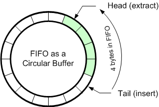

# Úkol 6 - Kruhová fronta v poli

| Termín odevzdání | 22.04.2022 23:59 AoE                         |
|------------------|----------------------------------------------|
| Povinné zadání   | 2b                                           |
| Volitelné zadání | 2b                                           |
| Bonusové zadání  | Není                                         |
| Počet uploadů    | 20                                           |
| Výchozí soubory  | [b3b36prg-hw06.zip](files/b3b36prg-hw06.zip) |


## Fronta

Fronta je datová struktura, u které jsou definovány operace výběru a vložení prvku. Operace výběr z fronty vybere prvek, který jsme vložili do fronty jako první. Při vkládání prvků do fronty se vkládaná položka vloží na jeho konec. (anglicky enqueue/push a dequeue/pop) Tato struktura se také někdy označuje termínem FIFO (first-in first-out).

Fronta se dá implementovat polem a to buď polem statické délky s explicitním omezením na počet vložených prvků nebo polem dynamické délky. Alterantivně se dá také realizovat datovou strukturou nazývanou spojový seznam, ale to není v této úloze povolené. Doplňující informace můžete nalézt na [Wikipedia - Queue](https://en.wikipedia.org/wiki/Queue_(abstract_data_type)).

## Naivní implementace fronty v poli

Nejjednodušší implementací fronty v poli je ukládání i-tého prvku ve frontě na i-tou pozici v poli. Přidávání nového prvku je velmi snadné. Nicméně vyjímání prvků může tvrvat dlouho, protože (abychom zachovali pořadí) je nutné nejprve vyjmout 1. prvek (z čela) fronty a všechny následující prvky posunout o jednu pozici. Taková implementace je značně neefektivní pro větší fronty, proto se zpravidla nepoužívá a ani v tomto úkolu nevede na správné řešení.

## Kruhová fronta v poli

 Kruhová fronta je efektivní implementace fronty v poli, ve které nedochází k žádnému posouvání prvků při operaci odebírání - pop(). Ve kruhové frontě si můžeme představit, že je alokované pole zacyklené. Nyní již neměníme pozici jednotlivých prvků, ale pouze pohybujeme s ukazateli na začátek a konec oblasti s daty. Při implementaci je potřeba dát pozor speciálně na situaci, kdy je několik prvních prvků ve frontě na konci pole a zbytek je již opět na začátku pole.

## Povinné zadání

Implementujte kruhovou frontu v poli (queue.c) podle zadaného hlavičkového souboru (queue.h), ve kterém si vhodně definujte strukturu queue_t obsahující samotnou frontu. Pokud se vkládaný prvek nevejde do fronty, tak ho nevkládejte a vraťte false ve funkci push_to_queue(). Odevzdávají se pouze soubory - queue.h a queue.c. Abychom mohli správnost řešení vašeho programu otestovat, je nutné implementovat definované rozhraní, tj. zachovat názvy a argumenty zadaných funkcí.


```
#ifndef __QUEUE_H__
#define __QUEUE_H__
 
#include <stdio.h>
#include <stdlib.h>
#include <stdbool.h>
 
/* Queue structure which holds all necessary data */
typedef struct {
   // TODO - Include your data structure here
} queue_t;
 
/* creates a new queue with a given size */
queue_t* create_queue(int capacity);
 
/* deletes the queue and all allocated memory */
void delete_queue(queue_t *queue);
 
/* 
 * inserts a reference to the element into the queue
 * returns: true on success; false otherwise
 */
bool push_to_queue(queue_t *queue, void *data);
 
/* 
 * gets the first element from the queue and removes it from the queue
 * returns: the first element on success; NULL otherwise
 */
void* pop_from_queue(queue_t *queue);
 
/* 
 * gets idx-th element from the queue
 * returns the element that will be popped after idx calls of the pop_from_queue() 
 * returns: the idx-th element on success; NULL otherwise
 */
void* get_from_queue(queue_t *queue, int idx);
 
/* gets number of stored elements */
int get_queue_size(queue_t *queue);
 
#endif /* __QUEUE_H__ */
```

Poznámky:
- Ve funkci delete_queue() uvažujeme, že při mazání je fronta již prázdná a není potřeba dealokovat jednotlivé elementy.
- Funkce get_from_queue() vrací element, který je ve frontě na indexu idx. Nijak to nesouvisí s vnitřní reprezentací. Neboli na indexu 0 je vždy element na začáteku fronty, který by byl jako první odstraněn funkcí pop_from_queue().

## Volitelné zadání

Dynamicky měňte velikost alokovaného pole tak, aby fronta využívala adekvátní množství paměti. Je potřeba pole zvětšovat i zmenšovat. Funkce push_to_queue() by se tak měla provést vždy úspěšně a vrátit true, pokud nejde k nějaké výjimečné události. Zvětšovat frontu doporučujeme vždy na dvojnásobek původní velikosti, pokud dojde k zaplnění celé fronty. Zmenšovat doporučujeme vždy na třetinu, když klesne pod tuto hranici. Vyhneme se tak časté změně velikosti.

## Testování

Pro účely testování jsme pro vás připravili jednoduchý testovací program (main.c), který simuluje práci s kruhovou frontou obsahující odkazy (ukazatele) na čísla typu int. Obecně ale může fronta obsahovat ukazatele jakéhokoliv typu a úkolem je napsat obecnou kruhovou frontu. Tato část slouží pouze pro jednodušší testování. Všechny potřebné soubory jsou v archivu [b3b36prg-hw06.zip](files/b3b36prg-hw06.zip).

Testovací program očekává na standardním vstupu velikost fronty N. Poté jsou na jednotlivých řádcích pokyny pro simulaci práce se frontou:
- a value - (push) - Alokuje pamět pro jedno číslo typu int, uloží do něj hodnotu value a ukazatel na toto číslo vloží na konec fronty zavoláním funkce push_to_queue().
- r - (pop) - Zavolá funkci pop_from_queue() a získá tak ukazatel na první element ve frontě, ze které byl zároveň odstraněn. Vypíše hodnotu čísla, na který odkazuje získaný ukazatel a uvolní jeho paměť.
- g idx - (get) - Zavolá funkci get_from_queue() a získá tak ukazatel na element ve frontě na indexu idx. Element nebyl z fronty odstraněn. Následně vypíše hodnotu čísla, na který odkazuje získaný ukazatel.

Na standardním výstupu tento simulátor vypisuje hodnoty pro operace r(pop), g(get). Pokud je dotaz neplatný, vypíše NULL.

> [!TIP]
> Podobný způsob testování je použit i v odevzdávacím systému.

### Příklad 1 - pub01-m
Vytvoří se kruhová fronta o velikosti 3 a vloží se tam ukazatele na tři celá čísla (1,2,3). Následně se prvky z fronty odstraní pomocí operace r-pop. Následně by fronta měla být prázdná.

| Standardní vstup                                      | Očekávaný výstup               | Očekávaný chybový výstup | Návratová hodnota |
|-------------------------------------------------------|--------------------------------|--------------------------|-------------------|
| <pre>3<br>a 1<br>a 2<br>a 3<br>r<br>r<br>r<br>r</pre> | <pre>1<br>2<br>3<br>NULL</pre> | žádný                    | 0                 |

### Příklad 2 - pub02-m

| Standardní vstup                               | Očekávaný výstup                  | Očekávaný chybový výstup | Návratová hodnota |
|------------------------------------------------|-----------------------------------|--------------------------|-------------------|
| <pre>3<br>a 1<br>g -1<br>g 0<br>g 1<br>r</pre> | <pre>NULL<br>1<br>NULL<br>1</pre> | žádný                    | 0                 |

(Další příklady jsou v poskytnutém archivu.)

## Testování v BRUTE

Pro některé testy v BRUTE nejsou použity vstupní soubory popsané v předchozí sekci, ale vámi implementované funkce jsou volány přímo ze zdrojového kódu. Je to proto, že by vstupní soubory byly příliš velké a hodnocení by trvalo zbytečně dlouho. Jednotilivé testy fungují následovně: [^1]

## Man03
1. Vytvoří se fronta o velikosti 100
2. Vloží se cca 90 elementů (push)
3. Vyjmou se všechny elementy (pop) a zkontroluje se jejich pořadí
4. Zkontroluje se, že je fronta prázdná (funkce get_queue_size() vrací nulu)

## Man04
1. Vytvoří se fronta o velikosti 100
2. Zaplní se přibližně do poloviny
3. Vloží se vždy jeden prvek a jeden se odstraní. Zkontroluje se přitom návratová hodnota a hodnota navráceného elementu (pomocí pop). Tento krok se provede 100000-krát.
4. Vyprázdní se zbytek fronty

## Man05
1. Vytvoří se několik front
2. Částečně se zaplní (push)
3. Vyprázdní se a zkontroluje se jejich obsah (pop)
4. Zkontroluje se, že jsou všechny fronty prázdná (funkce get_queue_size() vrací nulu)

## Opt01
1. Vytvoří se fronta o velikosti 100
2. Vloží se přibližně 1000000 elementů (push)
3. Zkontroluje se obsah (get)
4. Fronta se vyprázdní (pop)
5. Zkontroluje se, že je fronta prázdná (funkce get_queue_size() vrací nulu)

## Opt02
1. Vytvoří se 100 front o iniciální velikosti 10
2. Každá fronta se naplní N elementy a ihned následně vyprázdní
3. Kontroluje se tak správné uvolňování paměti


|                                              | Povinné zadání                         | Volitelné zadání                       |
|----------------------------------------------|----------------------------------------|----------------------------------------|
| Název v BRUTE                                | HW06                                   | HW06                                   |   
| Odevzdávané soubory                          | queue.h, queue.c                       | queue.h, queue.c                       |
| Argumenty při spuštění                       | žádné                                  | žádné                                  |
| Kompilace pomocí                             | clang -pedantic -Wall -Werror -std=c99 | clang -pedantic -Wall -Werror -std=c99 |
| Očekávaná amortizovaná časová složitost [^2] | O(1)                                   | O(1)                                   |

[^1]: Doplněno 07. 12. 207
[^2]: pro jednu operaci push, pop a get.


