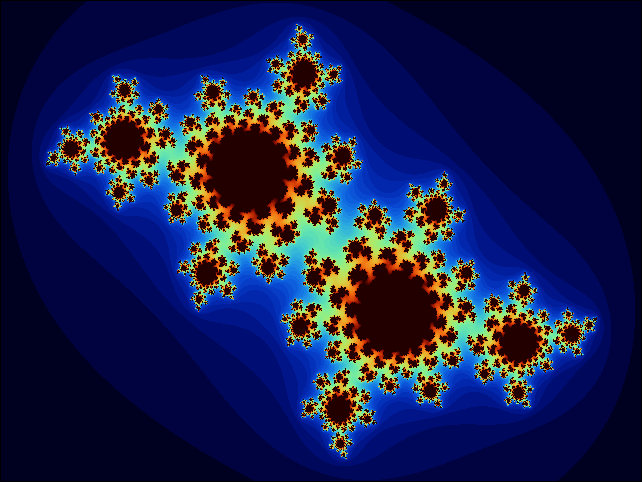
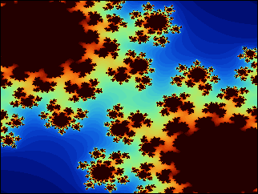
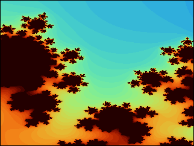
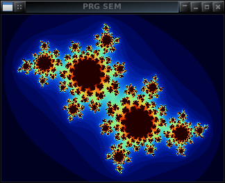

# Semestrální práce


| Termín odevzdání                | Nejlépe před 13.05.2023 23:59 CEST<br>Nejpozději 21.05.2023 23:59 CEST             |
|---------------------------------|------------------------------------------------------------------------------------|
| Základní implementace           | 10b                                                                                |
| Extra funkcionality             | až 10 bodů                                                                         |
| Bonusové funkcionality          | až 10 bodů                                                                         |
| Minimální počet bodů na zápočet | 10                                                                                 |
| Počet uploadů                   | 1 finální verze + případné opravy dle uvážení cvičícího (hodnotitele)              |
| Výchozí implementace            | [b3b36prg-sem.zip](files/b3b36prg-sem.zip) včetně referečního řešení obou aplikací |
| Podpora                         | Video tutoriál k ovládací aplikaci (180 min),[Hints](hints.md)                     |


> [!CAUTION]
> Při včasném odevzdání (první termín) lze řešit případné nedodělky do termínu finálního odevzdání. Detaily dohodněte se svým cvičícím.

> [!TIP]
> Specifikum práce s pojmenovanou rourou je, že při otevření souboru (roury) pro zápis musí být roura otevřena pro čtení, aby bylo kam případně ukládat data. Proto je volání io_open_write() blokované. Řešením je tak například spustit program výpočetního modulu ./bin/prgsem-comp_module nebo vyčítání roury programem tail -f /tmp/computational_module.in.

> [!WARNING]
> Zdůvodu problémů s binární staticky linkovanou spustitelnou aplikací prgsem-main-ref je použita dynamicky linkovaná binárka, která vyžaduje nainstalované knihovny <pre>linux_vdso.so.1<br>libSDL2-2.0.so.0<br>libSDL2_image-2.0.so.0<br>libc.so.6<br>libm.so.6<br>libdl.so.2<br>libpthread.so.0<br>librt.so.1<br>/lib64/ld-linux-x86-64.so.2</pre>


- Jan Faigl 2018/05/16 07:26 CEST Aktualizace: Linux binární spustitelný soubor
- Jan Faigl 2018/04/26 19:15 CEST Aktualizace: Nucleo aplikace v1.0 (test aktualizace zdrojových souboru pro mbed r149 a vyšší)
- Jan Faigl 2017/05/16 05:11 AKDT Aktualizace: Oprava výpočtu RGB složek barevného obrázku.
- Jan Faigl 2017/05/16 09:43 AKDT Aktualizace: Přidána dynamicky linkovaný binárka prgsem-main.dynamic.Linux
- Jan Faigl 2017/05/23 10:43 CEST Aktualizace: Linux verze dynamicky linkovaná na systémové knihovny prgsem-main.Linux, přidání ikony aplikace a funkce pro vyprázdnění fronty zpráv grafického rozhraní.


> [!TIP]
> Podporu používané knihovny [SDL](https://www.libsdl.org/) nainstalujte ideálně v rámci OS, např. apt install libsdl2-dev libsdl2-image-dev.

Semestrální práce navazuje na implementaci vícevláknové aplikace z cvičení lab09 a 8. a 9. přednášky, kterou rozšiřuje o výpočet fraktálu, který mapuje dynamický systém v části komplexní roviny do 2D obrázku. Konkrétně se jedná o výpočet Juliovy množiny, který je dán rekurzivní rovnicí:

z_(i+1)=(z_i)^2+c

pro kterou vyšetřujeme, zdali pro nějaké zvolené komplexní číslo c posloupnost čísel zi diverguje či nikoliv. Pro příslušný bod z0∈C tak dostáváme posloupnosti hodnot z1,z2,…,zn a říkáme, že bod z0 patří do Juliovy množiny, pokud je posloupnost hodnot z1,z2,…,zn omezená, tj. nediverguje. Test divergence posloupnosti můžeme imperativně otestovat pro zvolený počet prvků posloupnosti n tak, že ověříme, že platí |zi|<2 pro 0<i≤n. Tedy v případě, že absolutní hodnota libovolného komplexního čísla zi z posloupnosti zi∈z1,zn,…,n je větší nebo rovna 2 posloupnost diverguje a bod z0 leží vně Juliovy množiny. Přesnost určení zdali z0∈C patří nebo nepatří do Juliovy množiny záleží na počtu testovaných prvků posloupnosti z1,z2,…,zn. Pro větší hodnoty n může být výpočet náročnější, hodnota ale bude přesnější. Dále můžeme využít hodnotu prvního konkrétního kroku zk,0<k≤n, pro který není splněna podmína |zk|<2 využít k obarvení odpovídajícího bodu komplexní roviny a vytvořit tak barevný obrázek Juliovy množiny např.



Uvedený obrázek odpovídá zobrazení části komplexní roviny definované intervaly mezi body −1.6−1.1j a 1.6+1.1j na obrázek o rozměru 640×480 pro c=−0.4+0.6j a n=60. Body patřící do Juliovy množiny jsou zobrazeny černě a body, které do množiny nepatří, jsou označeny barvou podle příslušné hodnoty k, při které bylo poprvé detekováno, že bod z0 do množiny nepatří, tj. |zk|>2 pro konkrétní z0. Barva je vypočtena po složkách RGB podle

- R = 9(1−t)t^3⋅255;
- G =15(1−t)^2 t^2⋅255;
- B = 8.5(1−t)^3 t⋅255;

kde t je podíl k/n, tj. číslo od 0 do 1.

Nejzajímavější části Juliovy množiny jsou tak její okraje a zmenšením části komplexní roviny, ze které vybíráme komplexní čísla z0 můžeme přibližit okraj např.

Například pro obdélníkový výřez komplexní roviny definovaný body a,b∈C mapovaný do obrázku s rozlišením 320×240 získáme:

|  |  |
|-------------------------------|-------------------------------|
| a=−0.5−0.5j ,b=0.5+0.5j       | a=0.01+0.2j,b=0.05+0.25j      |

V našem případě rozdělíme vlastní výpočet a zobrazení nebo ovládání výpočetu na dvě samostatné aplikace, které spolu komunikují prostřednictvím tzv. [pojmenované roury](https://cs.wikipedia.org/wiki/Pojmenovan%C3%A1_roura), což je kominkace v podstatě indetická k přesměrovanéhmu standardnímu vstup a výstupu.

## Komunikační protokol

Program výpočetního modulu (dále jen Modul) počítá konkrétní část fraktálu podle zadaných parametrů, které jsou zasílány z ovládací aplikace. Vlastní výpočet probíhá tak, že řídicí aplikace zašle zprávu MSG_COMPUTE, která specifikuje část výpočtu tzv. chunk ID (cid). Výchozím bodem obdélníkového výřezu pro výpočet je dán komplexním číslem re+imj a počtem hodnot (sloupců) na reálné ose (z leva do prava) a počtem hodnot (řádku) na imaginární ose (zhora dolů). Krok sloupce a řádku, spolu s hodnotou komplexního čísla c a počtem kroků je součástí zprávy MSG_SET_COMPUTE. Definice jednotlivých zpráv odpovídá definici složeného typu struct message v souboru message.h

```
// Definition of the communication messages
typedef enum {
   MSG_OK,               // ack of the received message
   MSG_ERROR,            // report error on the previously received command
   MSG_ABORT,            // abort - from user button or from serial port
   MSG_DONE,             // report the requested work has been done
   MSG_GET_VERSION,      // request version of the firmware
   MSG_VERSION,          // send version of the firmware as major,minor, patch level, e.g., 1.0p1
   MSG_STARTUP,          // init message (id, up to 9 bytes long string, cksum)
   MSG_SET_COMPUTE,      // set computation parameters
   MSG_COMPUTE,          // request computation of a batch of tasks (chunk_id, nbr_tasks)
   MSG_COMPUTE_DATA,     // computed result (chunk_id, result)
   MSG_NBR
} message_type;
 
#define STARTUP_MSG_LEN 9
 
typedef struct {
   uint8_t major;
   uint8_t minor;
   uint8_t patch;
} msg_version;
 
typedef struct {
   uint8_t message[STARTUP_MSG_LEN];
} msg_startup;
 
typedef struct {
   double c_re;  // re (x) part of the c constant in recursive equation
   double c_im;  // im (y) part of the c constant in recursive equation
   double d_re;  // increment in the x-coords
   double d_im;  // increment in the y-coords
   uint8_t n;    // number of iterations per each pixel
} msg_set_compute;
 
typedef struct {
    uint8_t cid; // chunk id
    double re;    // start of the x-coords (real)
    double im;    // start of the y-coords (imaginary)
    uint8_t n_re; // number of cells in x-coords
    uint8_t n_im; // number of cells in y-coords
} msg_compute;
 
typedef struct {
   uint8_t cid;  // chunk id
   uint8_t i_re; // x-coords 
   uint8_t i_im; // y-coords
   uint8_t iter; // number of iterations
} msg_compute_data;
 
typedef struct {
   uint8_t type;   // message type
   union {
      msg_version version;
      msg_startup startup;
      msg_set_compute set_compute;
      msg_compute compute;
      msg_compute_data compute_data;
   } data;
   uint8_t cksum; // message command
} message;
```

Inicializační zpráva MSG_STARTUP může být například definována jako

```
message msg = { .data.startup.message =  { 'P', 'R', 'G', '-', 'S', 'E', 'M', '-', '1' } };
```

vhodnější je však například zakódovat do zprávy identifikaci autora, např. ČVUT username.

## Výměna zpráv a průběh komunikace

- Po startu Modul posílá zprávu MSG_STARTUP
- Na příjem zprávy MSG_GET_VERSION odpovídá Modul MSG_VERSION nebo MSG_ERROR
- Na příjem zprávy MSG_SET_COMPUTE odpovídá Modul MSG_OK nebo MSG_ERROR
- Na příjem zprávy MSG_COMPUTE odpovídá Modul MSG_OK a zahajuje výpočet nebo v případě chyby posílá MSG_ERROR. Výpočet probíhá postupně a pro každou hodnotu bodu (komplexní roviny/pixelu obrázku) zasílá Modul zprávu MSG_COMPUTE_DATA. Po dokončení výpočtu zasílá Modul zprávu MSG_DONE.
- Výpočet je možné přerušit zasláním zprávy MSG_ABORT, na kterou Modul odpovídá MSG_OK a přeruší a ukončí aktuáně probíhající výpočet (jeli v režimu výpočtu).
- Po přerušení výpočtu posílá Modul zprávu MSG_ABORT
- Přerušení výpočtu je možné interakcí s Modul aplikací. V takovém případě Modul přeruší výpočet a zasílá zprávu MSG_ABORT, tj. zprávu MSG_ABORT posílá Modul buď na základě stisku tlačítka nebo žádosti o přerušení výpočtu (poté co přeruší výpočet).

V případě zaslání zprávy MSG_SET_COMPUTE nebo i MSG_COMPUTE jsou nastaveny nové hodnoty a výpočet pokračuje podle posledně zadaných hodnot. Kdykoliv (i v případě běžícího výpočtu) je možné si vyžádat verzi firmware Modul zasláním zprávy MSG_GET_VERSION, na kterou Modul promptně odpovídá MSG_VERSION.

Typický průběh komunikace mezi ovládací aplikací (OA) a Modulem může vypadat například následovně:

- Modul: MSG_STARTUP
- PC: MSG_GET_VERSION
- Modul: MSG_VERSION
- PC: MSG_SET_COMPUTE
- Modul: MSG_OK
- PC: MSG_COMPUTE
- Modul: MSG_OK
- Modul: MSG_COMPUTE_DATA
- Modul: MSG_COMPUTE_DATA
- Modul: MSG_COMPUTE_DATA
- Modul: MSG_COMPUTE_DATA
- …
- Modul: MSG_COMPUTE_DATA
- Modul: MSG_DONE

Z definice zpráv je nutné uvažovat omezený rozsah n_re a n_im zprávy MSG_SET_COMPUTE, který spolu s bajtovou reprezentací c_id udává, jak je možné organizovat výpočet a jak velké obrázky (rozlišení) je možné aplikací počítat. Dále je omezen počet kroků n v rozsahu 8-mi bitového celého kladného čísla (typ uint8_t). Pragmaticky však nemá příliš smysl výpočet pro hodnoty n vyšší než 200.

## Výpočetní aplikace

Implementaci výpočetní aplikace lze přímo založit na příkladu vícevláknové aplikace z přednášky, kterou rozšíříme o reakci na zprávu MSG_SET_COMPUTE a MSG_COMPUTE spolu s funkcí pro výpočet části fraktálu pro jednoduchost v základní implementaci realizované jako posloupnost dílčích výpočtů jednotlivých pixelů, které jsou po jednom odesílány zprávami MSG_COMPUTE_DATA.

## Ovládací aplikace

Implementaci ovládací aplikace lze také založit na kódu z přednášky [b3b36prg-lec09-codes.zip](files/b3b36prg-lec09-codes.zip). Aplikace vyčítá hodnoty stiknutých kláves a příslušně reaguje. Výpis stavu aplikace lze jednoduše realizovat textovým výpisem (pro základní implementací semestrální práce). Způsob ovládání není striktně předepsán a záleží na invenci řešení. Může například reagovat na stisk následujících kláves:

- 'g' - vyžádá si číslo verze firmware Modul programu (MSG_GET_VERSION)
- 's' - nastaví parametry výpočtu (MSG_SET_COMPUTE)
- '1' - spustí výpočet (MSG_COMPUTE)
- 'a' - přeruší probíhající výpočet (MSG_ABORT)
- 'r' - resetuje cid
- 'l' - smaže aktuální obsah výpočtu (bufferu)
- 'p' - překreslí obsah okna aktuálním stavem výpočtu (bufferem)
- 'c' - spočte fraktál na PC (pro testovací a kontrolní účely)
- 'q' - korektně ukončí program terminací jednotlivých vláken a ukončením hlavního vlákna programu voláním

```return EXIT_SUCCESS;```

V průběhu běhu aplikce může program vypisovat dílčí stavy a události na standardní (chybový) výstup s nějakým jednoduchým rozlišením kategorie typu výpisu např. INFO, DEBUG, WARN, ERROR:

```
"ERROR: Cannot open serial port %s\n", serial
"INFO: Create thread '%s' %s\n", threads_names[i], ( r == 0 ? "OK" : "FAIL") 
"INFO: Get version requested\n"
"INFO: Set new computation resolution %dx%d no. of chunks: %d\n", ...
"WARN: New computation parameters requested but it is discarded due to on ongoing computation\n"
"INFO: Set new computation resolution %dx%d no. of chunks: %d\n", ..
"INFO: New computation chunk id: %d for part %d x %d\n", msg.data.compute.cid, msg.data.compute.n_re, msg.data.compute.n_im
"WARN: New computation requested but it is discarded due on ongoing computation\n"
"INFO: Chunk reset request\n"
"WARN: Chunk reset request discarded, it is currently computing\n"
"WARN: Abort requested but it is not computing\n"
"WARN: received grid results is out of range of the current grid"
"ERROR: send_message() does not send all bytes of the message!\n"
"INFO: Module restarted - '%s'\n", str
"INFO: Receive ok from Module\n"
"INFO: Module firmware ver. %d.%d-p%d\n", msg->data.version.major, msg->data.version.minor, msg->data.version.patch
"INFO: Module firmware ver. %d.%d\n", msg->data.version.major, msg->data.version.minor
"WARN: Receive error from Module\n"
"INFO: Abort from Module\n"
"DEBUG: received results %d\n", computation.grid[idx]
"WARN: received grid results is out of range of the current grid"
"WARN: received compute data has cid %d which is different from cid %d - cannot align data to the grid properly\x0a", msg->data.compute_data.cid, computation.cid
"WARN: Module sends new data without computing \n"
"INFO: Module reports the computation is done computing: %d\n", computation.computing
"INFO: Prepare new chunk of data cid: %d\n", msg_send.data.compute.cid
"ERROR: send_message() does not send all bytes of the message!\n"
"INFO: Call join to the thread %s\n", threads_names[i]
"INFO: Joining the thread %s has been %s\n", threads_names[i], (r == 0 ? "OK" : "FAIL")
"INFO: Exit input thread %p\n", pthread_self()
"ERROR: Unknown message type has been received 0x%x\n - '%c'", c, c
"ERROR: Cannot parse message type %d\n", msg_buf[0]
"WARN: the packet has not been received discard what has been read\n"
"ERROR: Cannot receive data from the serial port\n"
"INFO: Exit serial_rx_thread %p\n", pthread_self()
"DEBUG: Write message: "
```

## Vizualizace

Vlastní zobrazení fraktálu lze realizovat s využitím knihovny [SDL](https://www.libsdl.org/) a pro jednoduchost například s využitím modulu [xwin_sdl.zip](files/xwin_sdl.zip), který obsahuje pouze tři funkce:

- int xwin_init(int w, int h); - inicializuje okno o velikosti w×h pixelů
- void xwin_close(); - zavře incializované okno
- void xwin_redraw(int w, int h, unsigned char *img); - překreslí obrázek o velikosti w×h pixelů odkazovaný ukazatelem img ve formátu RGB, tj. každý pixel je dán trojicí 8bitových hodnot udávající barvu pixelu (v RGB) a prvních 3w hodnot tak definuje první řádek obrázku.
- void xwin_poll_events(void); - vyprázdní frontu zpráv aplikace od grafického rozhraní, které může například v systému Unity na Ubuntu způsobovat ztmavnutí okna aplikace. Funkci je vhodné volat například po stisku klávesy nebo zpracování událost v hlavní smyčce zpráv, či v periodicky volat v pravidelné aktualizaci obsahu grafického okna.

S ohledem na rychlost komunikace je doporučeno v základní implementaci počítat pouze malý obrázek, např. 320×240, pro který může vedle terminálového vstupu okno aplikace vypadat například



### Knihovna SDL
Knihovnu SDL je doporučeno použít ve verzi 2, tj. např. [sdl2-2.0.5](https://github.com/libsdl-org/SDL/releases/tag/release-2.30.7) a potřebné adresáře s hlavičkovými soubory a knihovnami pro linkování přidat prostřednictvím nástroje sdl2-config např. přidat do Makefile:

```
CFLAGS+=$(shell sdl2-config --cflags)
LDFLAGS+=$(shell sdl2-config --libs)
```

## Hodnocení
Hodnocení implementace obou částí zadání semestrální práce je složeno ze tří kategorií funkcionalit: základních, dodatečných (extra) a bonusových. Všechny zdrojové kódy je nutné nahrát do odevzdávacího systému BRUTE a to nejpozději k termínu odevzdání. Funkčnost aplikace bude hodnocena na základě uploadovaných souborů. Kromě vlastních funkcionalit je součástí hodnocení také prokázání orientace v kódu. Hodnocení bude provedeno dle časových dispozic hodnotitele a autora/ky semestrální práce, což by ideálně mělo proběhnout v průběhu semestru, nejpozději v posledním výukovém týdnu semestru. Dle časových a prostorových dispozic může dojít k vlastnímu hodnocení až v průběhu zkouškového, proto je pro termín odevzdání rozhodující datum uploadu všech souborů do odevzdávacího systému.

## Základní implementace
- Je ohodnocena až 10 body a v podstatě odpovídá ukázce řešení semestrální práce prezentované na přednášce, včetně vlastního výpočtu.
- Aplikace jde zkompilovat, nepadá a korektně ukončuje program.
- Aplikace po spuštění reportuje stav programu a výpočtu.
- Implementace výpočetní aplikace spolupracuje s ovládací aplikací.
- Aplikace komunikuje s výpočetní aplikaci, která počítá fraktál.
- Výsledek výpočtu je přenášen po pixelech a průběžně zobrazován v grafickém okně aplikace
- Program lze spustit s příslušnými argumenty, např. definující konkrétní port/blokové zařízení seriového portu, velikost obrázku nebo výřez komplexní roviny či počet iterací n.
- Program korektně ukončuje vlákna.
- Aplikace korektně uvolňuje alokovanou dynamickou paměť.
- Program splňuje standardy nějaké zvolené kódovací konvence, kód je čitelný a čtivý a dobře dokumentovaný (např. vhodně zvolenými identifikátory, ne nutně extra komentáři).
- Kontrolní hlášky o stavu aplikace jsou intuitivní a řádně popisují co se v aplikaci aktuálně děje.
- Program řádně ošetřuje možné výjimečné stavy a reaguje na případné chyby.
- Výpočet probíhající ve výpočetní aplikaci lze kdykoliv přerušit z řidící aplikace nebo stisknutím tlačítka na standardním vstupu aplikace.
- Student/studentka prokáže orientaci v kódu

> [!WARNING]
> Základní implementace zahrnuje zejména ovládací aplikaci. Extra funkcionality, například BURST zpráva, vyžaduje úpravu výpočetního modulu (aplikace).

## Zvláště hodnocené (extra) funkcionality
Zvláště hodnocené funkcionality podstatným způsobem rozšiřují možnosti aplikace a uživatelského komfortu. Níže uvedený výčet je indikativní spolu s možným bodovým ziskem a představuje vodítko jakým směrem lze aplikaci rozšířit s využitím funkcí a knihoven, které jsou nutné pro realizaci základní verze aplikace.

- Zrychlení výpočtu BURST režimem, při kterém výpočet ve výpočetní aplikaci kumuluje výsledky. Místo zprávy pro každý individuální pixel posílá pouze několik zpráv, případně pouze jednu zprávu, s dílčími hodnotami. (až 5 bodů)

```
// Definice zprávy ''MSG_COMPUTE_DATA_BURST'' může například vypadat
typedef struct {
   uint8_t chunk_id;
   uint16_t length; // number of pixels in the data message
   uint8_t *iters;  // pointer to the array of the compute number of iterations 
                    // particular values of the array are transmitted; thus, 
                    // marshaling and unmarshaling have to be properly handled
                    // together with the proper memory managing
} msg_compute_data_burst; 
```

- Interaktivní volba velikosti obrázku (např. nějakou vhodnou klávesovou zkratkou) (až 2 body)
- Interaktivní volba parametru c případně volba rozsahu (zoom) (až 2 body)
- Animace obrázku fraktálu, např. na základě plynulé změny hodnoty parametru c. Výpočet může být realizován v rámci ovládací aplikace na PC (až 2 body)

Maximální počet bodů za povedené dodatečné funkcionality může hodnotitel v odůvodněných případech navýšit v rámci bonusových funkcionalit.

## Bonusové funkcionality
Bonusové funkcionality představují významné rozšíření aplikace, které vyžaduje využití dodatečných knihoven nebo mnohem náročnější implementaci a testování než v případě zvláště hodnocených (extra) funkcionalit. Možnostem rozšíření se omezení nekladou, je však nutné zvolit vhodný kompromis mezi nápadem na rozšíření a jeho odpovídající implementací a otestováním, tj. zajímavé nápady, které se nepodaří implementovat a dostatečně otestovat pro uspokojivou uživatelskou zkušenost s aplikací nebudou ohodnoceny tak jako méně ambiciozní, ale za to propracovanější rozšíření.

Příklady možných rozšíření o bonusové funkcionality mohou být následující.

- Uložení obrázku do souboru .jpg nebo .png či vytvoření animace v některém běžném video formátu. (až 3 body).
- Automatické překreslení grafického okna při překryvu jiným oknem (až 2 body).
- Vytvoření plně grafické aplikace s odchytáváním zpráv grafického okna a zobrazením textu (např. s využitím SDL_Event a TTF_RenderText_Solid) (až 10 bodů).
- Paralelní výpočet fraktálu s využitím více výpočetních aplikací s volbou strategie rozdělení výpočtu (až 10 bodů).


